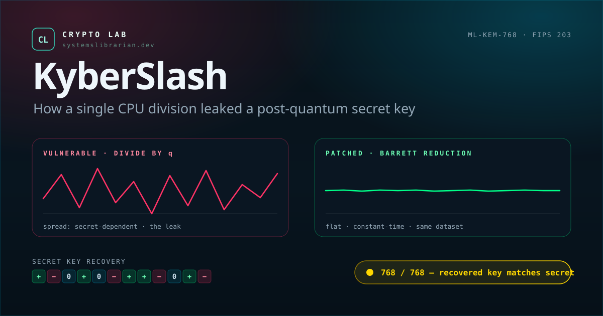

# crypto-lab-kyberslash

## What It Is

Browser-based educational simulation of the KyberSlash timing attacks on ML-KEM (Kyber), based on the 2025 TCHES CHES Best Paper by Daniel J. Bernstein, Karthikeyan Bhargavan, Shivam Bhasin, Anupam Chattopadhyay, Tee Kiah Chia, Matthias J. Kannwischer, Franziskus Kiefer, Thales B. Paiva, Prasanna Ravi, and Goutam Tamvada. The demo shows how integer division by the Kyber modulus q = 3329 in the reference `poly_tomsg` and `poly_compress` functions leaks secret information through variable CPU timing on ARM Cortex-A7 and Cortex-M4 processors. Because JavaScript cannot measure real CPU division latency reliably, the browser uses a deterministic timing model that reproduces the paper's leakage behavior instead of real clock measurements. The lab shows the vulnerable code, the fixed Barrett-reduction replacement, a live attack simulation that recovers the vulnerable secret key, and the failed attack against the patched implementation.

## When to Use It

- Understanding why “NIST standardized” does not mean “every implementation is safe”
- Teaching timing side channels in the context of post-quantum cryptography
- Explaining constant-time programming discipline to developers deploying ML-KEM
- Comparing KyberSlash1 and KyberSlash2 as concrete examples of secret-dependent division leakage
- Understanding why verified and side-channel-audited implementations such as Cryspen and HACL* matter
- Evaluating what questions to ask about a real PQ deployment on its actual target hardware
- Do NOT use it for attacking real systems; maintained libraries were patched before disclosure and this repository is an educational simulation only

## Live Demo

**[systemslibrarian.github.io/crypto-lab-kyberslash](https://systemslibrarian.github.io/crypto-lab-kyberslash/)**

Step through a side-by-side oscilloscope where the vulnerable trace swings with secret-dependent division latency while the patched Barrett-reduction trace stays flat, then run a live attack that reconstructs all 768 ML-KEM-768 secret coefficients one by one and verifies them against the real key. Toggle between a simulated Cortex-A7 (Raspberry Pi 2) and Cortex-M4 to see how the leak narrows but persists across targets.

## What Can Go Wrong

- **This is a simulation.** Browsers do not expose stable instruction-level timing for CPU division, so the demo uses a deterministic leakage model inspired by the paper's measurements rather than real cycle counts from your machine.
- **The vulnerabilities shown here are patched.** Current maintained implementations such as PQClean, liboqs, mlkem-native, and OpenSSL integrations are not expected to reproduce the pre-patch behavior.
- **Other side channels still exist.** Timing leakage is only one class of implementation failure; cache effects, EM leakage, power analysis, speculative execution, and fault injection are separate attack surfaces.
- **Compiler behavior matters.** Modern x86_64 often rewrites division by a constant into multiplication automatically, but some build configurations such as `-Os` can reintroduce actual division on certain targets.
- **Formal verification and constant-time guarantees are different properties.** A program can be functionally correct and still leak through timing if the implementation path is not side-channel-audited.

## Real-World Usage

- The KyberSlash attacks were published as **“KyberSlash: Exploiting secret-dependent division timings in Kyber implementations”** in IACR Transactions on Cryptographic Hardware and Embedded Systems 2025, issue 2, pages 209–234 (ePrint 2024/1049), and won the CHES 2025 Best Paper Award.
- The work showed two distinct vulnerabilities: **KyberSlash1** in decryption via `poly_tomsg`, and **KyberSlash2** in encryption via `poly_compress`.
- On Raspberry Pi 2 hardware with ARM Cortex-A7, the paper reports secret recovery in a few hours for KyberSlash1 and minutes for KyberSlash2; ARM Cortex-M4 targets were also shown to leak.
- Major implementations were patched during responsible disclosure before public release, including the Kyber reference code and downstream consumers such as libpqcrypto, PQClean, liboqs, mlkem-native, and OpenSSL-related integrations.
- The broader lesson is the one this lab emphasizes: standardization does not remove the need for independent side-channel review on each deployment target.

## How to Run Locally

```bash
git clone https://github.com/systemslibrarian/crypto-lab-kyberslash
cd crypto-lab-kyberslash
npm install
npm run dev
```

## Related Demos

- [crypto-lab-lattice-fault](https://systemslibrarian.github.io/crypto-lab-lattice-fault/) — broader side-channel and fault surface across ML-KEM and ML-DSA.
- [crypto-lab-kyber-vault](https://systemslibrarian.github.io/crypto-lab-kyber-vault/) — the ML-KEM scheme itself: KeyGen, Encaps, Decaps.
- [crypto-lab-hqc-timing](https://systemslibrarian.github.io/crypto-lab-hqc-timing/) — a timing oracle in another post-quantum KEM (HQC).
- [crypto-lab-ciphertext-mirror](https://systemslibrarian.github.io/crypto-lab-ciphertext-mirror/) — ML-KEM decoder and FO-transform attack surface.

## What You Learn In 3 Minutes

- **The bug**: a single `/ KYBER_Q` on a secret-dependent operand inside `poly_tomsg` and `poly_compress` leaks key bits through CPU `udiv` latency.
- **The fix**: replace the divide with Barrett reduction (`(x * BARRETT_INV) >> 32`) so the secret path becomes constant-time.
- **The proof**: an in-browser oscilloscope shows the vulnerable mean swinging while the patched mean is flat, and a live attack reconstructs all 768 ML-KEM-768 secret coefficients into a verified match against the real key.
- **The point**: NIST standardisation is a mathematical contract; side-channel safety is a separate property and has to be audited per target — Cortex-A7 leaks differently than Cortex-M4, and `-Os` can reintroduce division on platforms x86_64 normally avoids.

## Highlights



- **Flip to patched** — the same dataset on the same axes; the vulnerable signal swings and the patched signal goes flat. The signature "aha" moment.
- **Live recovery** — 768 coefficients reconstructed one by one, with a gold pill that confirms a verified match against the real key.
- **Two platforms** — toggle a simulated Cortex-A7 (Raspberry Pi 2) or Cortex-M4 to see how the leak narrows but persists.

> Want animated captures? `docs/CAPTURES.md` has exact framing instructions for an optional `flip-to-patched.gif` and `attack-progression.png`. Drop them into `docs/` to embed them here; until then the poster above and the [live demo](https://systemslibrarian.github.io/crypto-lab-kyberslash/) carry the visuals.

---

*One of 120+ browser demos in the [Crypto Lab](https://crypto-lab.systemslibrarian.dev/) suite.*

*"So whether you eat or drink or whatever you do, do it all for the glory of God." — 1 Corinthians 10:31*
